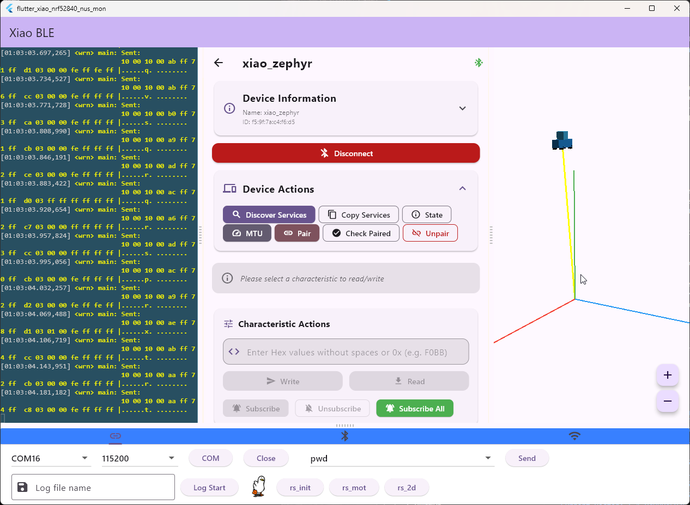

# flutter_xiao_nrf52840_nus_mon

Window BLE utility for xiao nrf52840 kit.
This is demo application with xiao_nrf52840_sense_peripheral_nus FW.
Based code is from "flutter_xterm_uart_split_window"

## TODOs

- ~~Split window set up~~
- ~~Basic code prepare~~
- Terminal feature
  - copy and paste window
  - keyboard input
  - ~~COM port feature~~
- BLE basic connection feature
- ~~universal_ble v1.0 apply~~
  - ~~some differences at code~~
- ~~IMU data display at 3d chart~~

## History

- 2025.12.22
  - First commit
- 2025.12.29
  - RGB Led control toggle button added
    - it works with xiao evm
  - need to consider new UI screen to control BLE NUS
    - bluetooth screen includes toggle buttons and it looks not good
- 2026.01.02
  - universal_ble v1.0 applied and LED control works
  - Added API, _writeToBle, at ble menu tab and could use this for others
  - Display GAP/GATT string when prints service info
- 2026.01.06
  - IMU data displayed at 3d chart with car icon
  - Need to subscribe notify service
  - bug fix : when app is closed without closing com port, it usually open fails when i open again. Added safe code and fixed this bug
- 2026.01.07
  - RTC Get/Set(with calendar screen) is added

## Info

- Author : Louiey
- Flutter 3.35.7
- Target : xiao nrf52840 kit with xiao_nrf52840_sense_peripheral_nus SW
